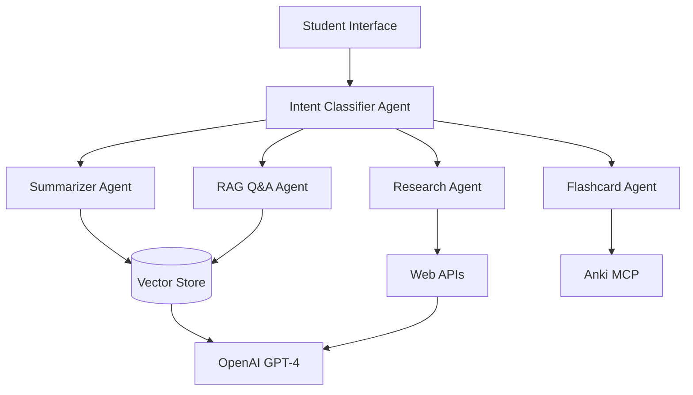

# 🎓 AI Study Agent Workshop Guide

**Duration**: 3-4 hours
**Level**: Intermediate
**Prerequisites**: Basic Python, FastAPI, and AI concepts

## 🎯 Learning Objectives

By the end of this workshop, participants will be able to:

1. **Build Multi-Agent AI Systems** - Create specialized AI agents for different study tasks
2. **Implement RAG Architecture** - Set up document retrieval and question-answering systems
3. **Design Intent Classification** - Route user queries to appropriate AI specialists
4. **Integrate External APIs** - Connect with OpenAI, vector stores, and MCP protocols
5. **Create Educational Tools** - Build practical study assistants for real-world use

---

## 🏗️ Workshop Architecture



---

## 📋 Workshop Phases

### **Phase 1: Upload & Summarize** ⏱️ *30-45 minutes*

**Objective**: Build document upload and AI summarization capabilities

**What You'll Build**:
- File upload system with validation
- AI-powered document summarization
- Structured summary format with key concepts

**API Endpoints**:
```http
POST /exam-assistant/vector-store/files    # Upload documents
POST /exam-assistant/summarize             # Generate summaries
GET  /exam-assistant/summaries/{doc_id}    # Retrieve summaries
```

**Key Code**:
```python
# Document Upload with Vector Store
uploaded_file = await vector_store_service.upload_file_to_vector_store(
    file=file_obj, filename=file.filename
)

# AI Summarization
summary = await summarizer_agent.process(task)
```

**Learning Points**:
- Vector store integration with OpenAI
- File handling and validation in FastAPI
- Structured AI prompting for educational content

---

### **Phase 2: RAG Q&A System** ⏱️ *60-75 minutes*

**Objective**: Enable students to ask questions about their study materials

**What You'll Build**:
- Document retrieval system
- Contextual question answering
- Source citation and reasoning display

**API Endpoints**:
```http
POST /exam-assistant/chatkit                    # Ask questions
GET  /exam-assistant/threads/{id}/citations     # Get sources
POST /exam-assistant/chat/ask                   # Enhanced Q&A
```

**Key Code**:
```python
# RAG Implementation
file_search_tool = FileSearchTool(
    vector_store_ids=[config.knowledge_vector_store_id],
    max_num_results=10
)

# Contextual response with citations
response = await rag_agent.process(query, context=documents)
```

**Learning Points**:
- Retrieval-Augmented Generation (RAG) architecture
- ChatKit integration for streaming responses
- Citation and source tracking

---

### **Phase 3: Research Agent** ⏱️ *45-60 minutes*

**Objective**: Add web research capabilities for external information

**What You'll Build**:
- Web search integration
- Source validation and summarization
- Automatic knowledge base expansion

**API Endpoints**:
```http
POST /exam-assistant/research/query              # Start research
GET  /exam-assistant/research/results/{id}       # Get results
POST /exam-assistant/research/save-to-vectorstore # Save findings
```

**Key Code**:
```python
# Web Research Integration
search_results = await web_search_api.search(query)
validated_sources = await source_validator.validate(search_results)
summary = await research_agent.synthesize(validated_sources)
```

**Learning Points**:
- External API integration patterns
- Source validation and reliability scoring
- Automated knowledge expansion

---

### **Phase 4: MCP Anki Integration** ⏱️ *45-60 minutes*

**Objective**: Generate flashcards and integrate with Anki for spaced repetition

**What You'll Build**:
- AI-powered flashcard generation
- Model Context Protocol (MCP) integration
- Anki deck export functionality

**API Endpoints**:
```http
POST /exam-assistant/flashcards/generate      # Generate cards
POST /exam-assistant/flashcards/export-anki  # Export to Anki
GET  /exam-assistant/flashcards/deck/{id}    # View deck
```

**Key Code**:
```python
# MCP Anki Integration
mcp_client = AnkiMCPClient()
flashcards = await flashcard_agent.generate(document_content)
deck_id = await mcp_client.create_deck(flashcards)
```

**Learning Points**:
- Model Context Protocol (MCP) architecture
- Anki integration for spaced repetition
- AI-driven study material generation

---

### **Phase 5: Intent Routing** ⏱️ *30-45 minutes*

**Objective**: Create intelligent query routing to appropriate agents

**What You'll Build**:
- Intent classification system
- Multi-agent coordination
- Smart conversation flows

**API Endpoints**:
```http
POST /exam-assistant/classify-intent       # Classify user intent
POST /exam-assistant/chat/smart-route     # Route to best agent
GET  /exam-assistant/agents/capabilities  # View available agents
```

**Key Code**:
```python
# Intent Classification
classification = await intent_classifier.classify(user_query)
agent_type = classification.get("intent")
confidence = classification.get("confidence")

# Smart Routing
if agent_type == "SUMMARIZER":
    response = await summarizer_agent.process(task)
elif agent_type == "RESEARCH":
    response = await research_agent.process(task)
```

**Learning Points**:
- Intent classification with LLMs
- Multi-agent system coordination
- Conversation flow management

---

## 🛠️ Setup Instructions

### 1. Prerequisites Installation

```bash
# Install Python dependencies
cd backend
uv sync

# Install frontend dependencies
cd ../frontend
npm install

# Set up environment variables
cp .env.template .env
# Edit .env with your API keys
```

### 2. Required API Keys

Add to your `.env` file:
```env
OPENAI_API_KEY=sk-proj-your-key-here
EXAM_PREP_VECTOR_STORE_ID=vs_your-vector-store-id
VITE_EXAM_PREP_CHATKIT_API_DOMAIN_KEY=your-domain-key
```

### 3. Start Development Servers

```bash
# Terminal 1: Start backend
npm run backend

# Terminal 2: Start frontend
npm run dev

# Access the application
# Backend API: http://localhost:8002
# Frontend UI: http://localhost:5172
# API Docs: http://localhost:8002/docs
```

---

## 🧪 Testing Guide

### Phase 1: Document Upload & Summarization
```bash
# Test file upload
curl -X POST -F "file=@sample_lecture.pdf" \
  http://localhost:8002/exam-assistant/vector-store/files

# Test summarization
curl -X POST -H "Content-Type: application/json" \
  -d '{"document_id":"doc_123","focus_areas":["key concepts"]}' \
  http://localhost:8002/exam-assistant/summarize
```

### Phase 2: Q&A System
```bash
# Test question answering
curl -X POST -H "Content-Type: application/json" \
  -d '{"messages":[{"role":"user","content":"What are the main concepts in quantum mechanics?"}]}' \
  http://localhost:8002/exam-assistant/chatkit
```

### Phase 3: Research Integration
```bash
# Test research query with source validation
curl -X POST -H "Content-Type: application/json" \
  -d '{"query":"quantum computing developments","save_to_vectorstore":true}' \
  http://localhost:8002/exam-assistant/research/query

# Get research results by task ID
curl -X GET http://localhost:8002/exam-assistant/research/results/task_123
```

### Phase 4: Flashcard Generation & MCP Integration
```bash
# Generate flashcards with different difficulty levels
curl -X POST -H "Content-Type: application/json" \
  -d '{"document_id":"doc_123","card_count":5,"difficulty":"medium","deck_name":"Physics Study Cards"}' \
  http://localhost:8002/exam-assistant/flashcards/generate

# Export flashcards to Anki via MCP
curl -X POST -H "Content-Type: application/json" \
  -d '{"deck_id":"deck_123","card_count":5}' \
  http://localhost:8002/exam-assistant/flashcards/export-anki

# View flashcard deck information
curl -X GET http://localhost:8002/exam-assistant/flashcards/deck/deck_123
```

### Phase 5: Intent Classification & Smart Routing
```bash
# Test intent classification for different query types
curl -X POST -H "Content-Type: application/json" \
  -d '{"query":"Can you summarize chapter 3 for me?"}' \
  http://localhost:8002/exam-assistant/classify-intent

# Test smart chat routing (combines classification + routing)
curl -X POST -H "Content-Type: application/json" \
  -d '{"message":"I need flashcards for quantum physics","user_id":"student123"}' \
  http://localhost:8002/exam-assistant/chat/smart-route

# View all available agents and their capabilities
curl -X GET http://localhost:8002/exam-assistant/agents/capabilities
```

---

## 🎯 Extension Ideas

After completing the workshop, participants can extend the system with:

1. **Advanced RAG Techniques**
   - Hybrid search (vector + keyword)
   - Re-ranking algorithms
   - Multi-hop reasoning

2. **Enhanced UI Features**
   - Document highlighting
   - Interactive citations
   - Study progress tracking

3. **Additional Integrations**
   - Notion for note-taking
   - Google Drive for file storage
   - Zoom for lecture transcription

4. **Advanced AI Features**
   - Multi-modal processing (images, audio)
   - Personalized learning paths
   - Difficulty adaptation

---

## 📚 Resources

- [OpenAI API Documentation](https://platform.openai.com/docs)
- [FastAPI Documentation](https://fastapi.tiangolo.com/)
- [ChatKit Documentation](https://github.com/anthropics/chatkit)
- [MCP Protocol Specification](https://mcpservers.org/)
- [Anki MCP Server](https://ankimcp.ai/)

---

## 📋 Complete API Reference

### Study Agent Endpoints

#### 1. Document Summarization
- **POST** `/exam-assistant/summarize`
- **GET** `/exam-assistant/summaries/{document_id}`

**Example Request:**
```json
{
  "document_id": "doc_123",
  "document_type": "lecture_notes",
  "focus_areas": ["key concepts", "definitions"]
}
```

#### 2. Intent Classification & Routing
- **POST** `/exam-assistant/classify-intent`
- **POST** `/exam-assistant/chat/smart-route`
- **GET** `/exam-assistant/agents/capabilities`

**Example Request:**
```json
{
  "query": "I need help understanding quantum mechanics",
  "user_id": "student123",
  "session_id": "session456"
}
```

#### 3. Research Agent
- **POST** `/exam-assistant/research/query`
- **GET** `/exam-assistant/research/results/{task_id}`

**Example Request:**
```json
{
  "query": "latest quantum computing developments",
  "save_to_vectorstore": true,
  "user_id": "student123"
}
```

#### 4. Flashcard Generation & MCP Integration
- **POST** `/exam-assistant/flashcards/generate`
- **POST** `/exam-assistant/flashcards/export-anki`
- **GET** `/exam-assistant/flashcards/deck/{deck_id}`

**Example Request:**
```json
{
  "document_id": "doc_123",
  "card_count": 10,
  "difficulty": "medium",
  "deck_name": "Physics Study Deck"
}
```

### Core Endpoints (Existing)

#### Document Management
- **GET** `/exam-assistant/documents` - List uploaded documents
- **POST** `/exam-assistant/vector-store/files` - Upload new documents

#### ChatKit Integration
- **POST** `/exam-assistant/chatkit` - Streaming Q&A with RAG
- **GET** `/exam-assistant/threads/{thread_id}/citations` - Get source citations

#### Health & Status
- **GET** `/exam-assistant/health` - API health check
- **GET** `/exam-assistant/vector-store` - Vector store status

### Response Formats

All agent responses follow this standard format:

```json
{
  "success": true,
  "content": {}, // Agent-specific content
  "reasoning": ["Step 1", "Step 2"],
  "metadata": {},
  "task_id": "uuid",
  "sources": [] // For research/RAG responses
}
```

### Error Handling

```json
{
  "success": false,
  "error_message": "Detailed error description",
  "task_id": "uuid"
}
```

---

## 🏆 Workshop Completion

Participants will have built a fully functional AI study assistant with:

✅ **Multi-Agent Architecture** - 5 specialized AI agents
✅ **RAG System** - Document retrieval and Q&A
✅ **Web Integration** - Research and knowledge expansion
✅ **Study Tools** - Flashcards and spaced repetition
✅ **Smart Routing** - Intelligent query classification

**Certificate of Completion**: Participants receive a certificate showing proficiency in AI agent systems, RAG architecture, and educational AI applications.

---

*Happy Learning! 🎓🤖*
